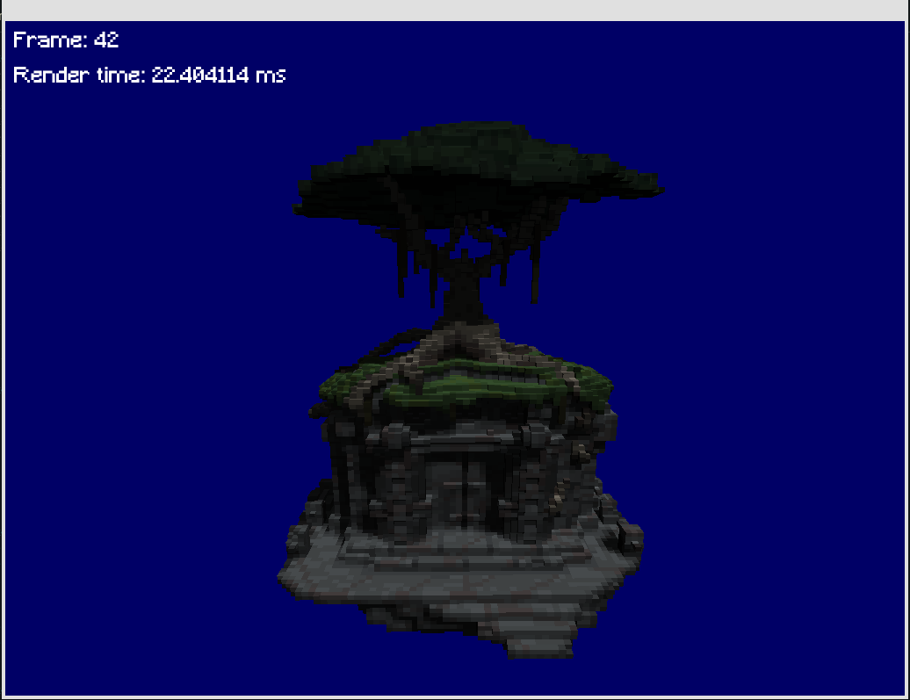
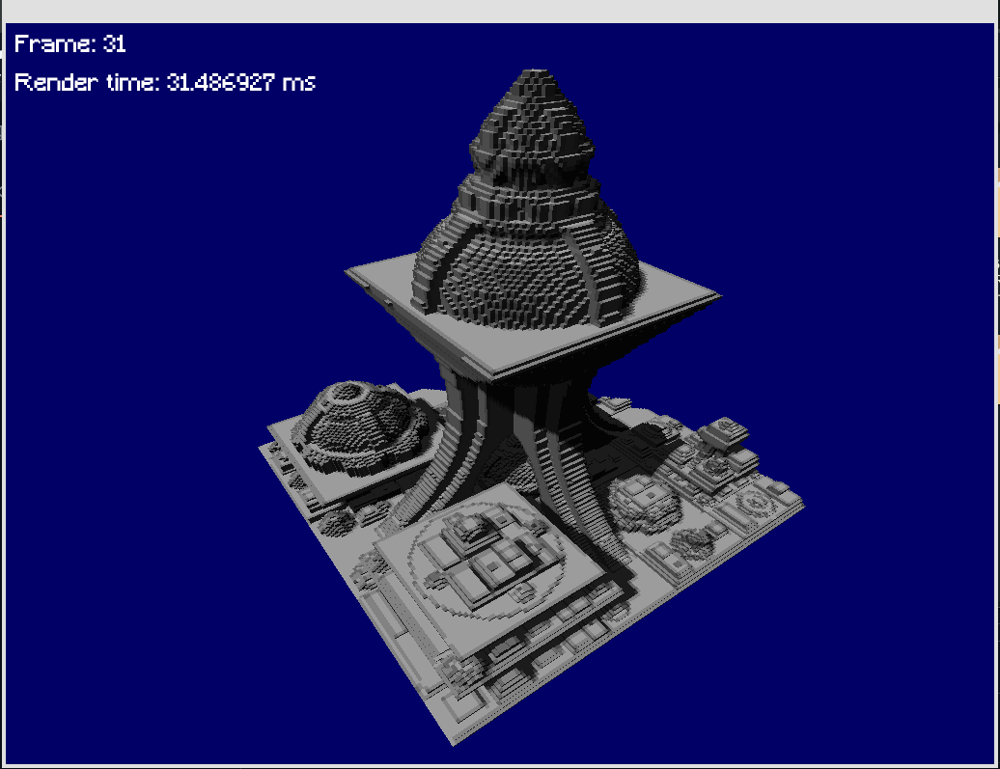
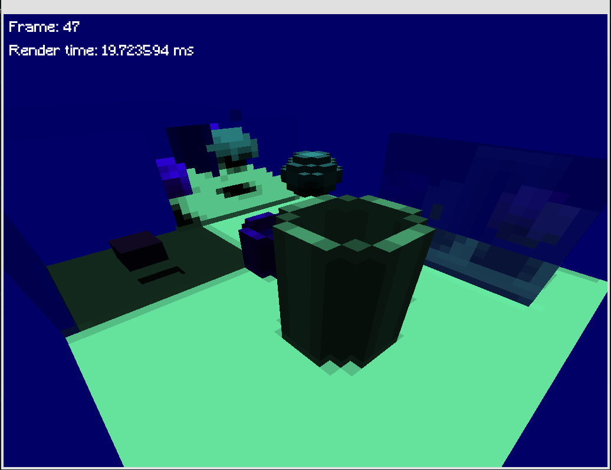

# 3D Voxel Renderer

This project is a 3D engine that utilizes voxels to render .vox files. The engine is implemented in C++ with OpenGL, relying solely on shaders without any external libraries. It provides a simple and efficient way to visualize voxel-based models.

## Compilation

To compile the project, follow these steps:

1. Run the following command to generate the build files using CMake:
   ```
   cmake -S . -B build
   ```

2. Once the build files are generated, execute the following command to build the project:
   ```
   cmake --build build
   ```

This will create a binary named "renderer" at the root of the repository.

## Usage

Launch the program by executing the binary and providing the necessary arguments:

```
./renderer <file_path> <chunk_size> <debug_mode>
```

- `file_path`: The path to the .vox file you want to render.
- `chunk_size`: The size of the chunks in the rendering process.
- `debug_mode`: Set this argument to 0 or 1 to enable or disable debug mode, respectively.

## Navigation

Once the program is running, you can navigate through the 3D rendering using the mouse and keyboard controls. Use the following keys for navigation:

- **Mouse**: Move the mouse to adjust the camera view.
- **Arrow Keys**: Move the sun in the scene to control lighting and shadows.

## Known limitations

Shadown are not shared among chunks and only 4 chunks can be rendered at the same time (this is due to a limitation in opengl and shaders)

## Images





Happy rendering!
